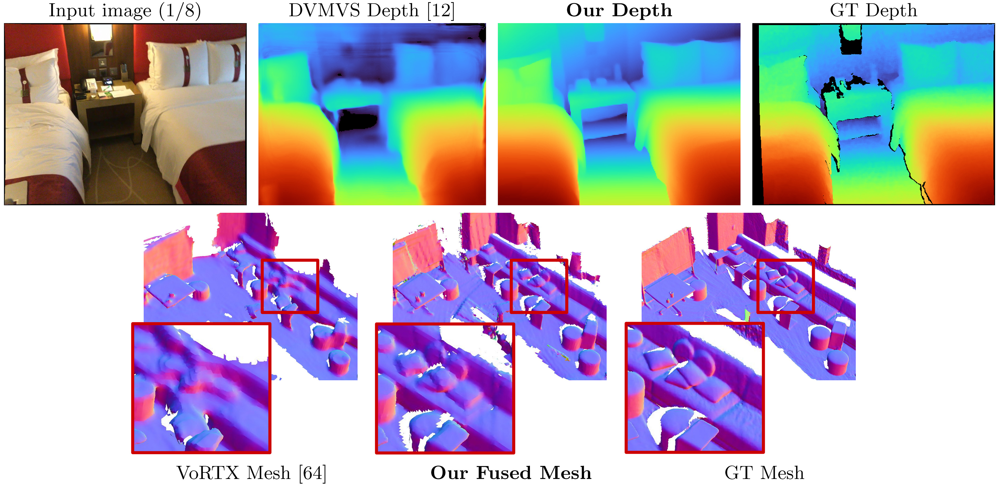

# SimpleRecon: 3D Reconstruction Without 3D Convolutions

This is the reference PyTorch implementation for training and testing MVS depth estimation models using the method described in

> **SimpleRecon: 3D Reconstruction Without 3D Convolutions**
>
> [Mohamed Sayed](https://masayed.com), [John Gibson](https://www.linkedin.com/in/john-e-gibson-ii/), [Jamie Watson](https://www.linkedin.com/in/jamie-watson-544825127/), [Victor Adrian Prisacariu](https://www.robots.ox.ac.uk/~victor/), [Michael Firman](http://www.michaelfirman.co.uk), and [Clément Godard](http://www0.cs.ucl.ac.uk/staff/C.Godard/)
>
> [Paper, ECCV 2022 (arXiv pdf)](https://arxiv.org/abs/2208.14743), [Supplemental Material](https://nianticlabs.github.io/simplerecon/resources/SimpleRecon_supp.pdf), [Project Page](https://nianticlabs.github.io/simplerecon/), [Video](https://youtu.be/3LP8jp45Ef8)

<p align="center">
  
</p>

https://github.com/nianticlabs/simplerecon/assets/14994206/ae5074c2-6537-45f1-9f5e-0b3646a96dcb

https://user-images.githubusercontent.com/14994206/189788536-5fa8a1b5-ae8b-4f64-92d6-1ff1abb03eaf.mp4

This code is for non-commercial use; please see the [license file](LICENSE) for terms. If you do find any part of this codebase helpful, please cite our paper using the BibTex below and link this repo. Thanks!

## 🆕 Updates

25/05/2023: Fixed package verions for `llvm-openmp`, `clang`, and `protobuf`. Do use this new environment file if you have trouble running the code and/or if dataloading is being limited to a single thread.

09/03/2023: Added kornia version to the environments file to fix kornia typing issue. (thanks @natesimon!)

26/01/2023: The license has been modified to make running the model for academic reasons easier. Please the LICENSE file for the exact details.

There is an update as of 31/12/2022 that fixes slightly wrong intrinsics, flip augmentation for the cost volume, and a 
numerical precision bug in projection. All scores improve. You will need to update your forks and use new weights. See [Bug Fixes](#-bug-fixes).

Precomputed scans for online default frames are here: https://drive.google.com/drive/folders/1dSOFI9GayYHQjsx4I_NG0-3ebCAfWXjV?usp=share_link 

## Table of Contents

  * [🗺️ Overview](#%EF%B8%8F-overview)
  * [⚙️ Setup](#%EF%B8%8F-setup)
  * [📦 Models](#-models)
  * [🚀 Speed](#-speed)
  * [📝 TODOs:](#-todos)
  * [🏃 Running out of the box!](#-running-out-of-the-box)
  * [💾 ScanNetv2 Dataset](#-scannetv2-dataset)
  * [🖼️🖼️🖼️ Frame Tuples](#%EF%B8%8F%EF%B8%8F%EF%B8%8F-frame-tuples)
  * [📊 Testing and Evaluation](#-testing-and-evaluation)
  * [👉☁️ Point Cloud Fusion](#%EF%B8%8F-point-cloud-fusion)
  * [📊 Mesh Metrics](#-mesh-metrics)
  * [⏳ Training](#-training)
    + [🎛️ Finetuning a pretrained model](#%EF%B8%8F-finetuning-a-pretrained-model)
  * [🔧 Other training and testing options](#-other-training-and-testing-options)
  * [✨ Visualization](#-visualization)
  * [📝🧮👩‍💻 Notation for Transformation Matrices](#-notation-for-transformation-matrices)
  * [🗺️ World Coordinate System](#%EF%B8%8F-world-coordinate-system)
  * [🐜🔧 Bug Fixes](#-bug-fixes)
  * [🗺️💾 COLMAP Dataset](#%EF%B8%8F-colmap-dataset)
  * [🙏 Acknowledgements](#-acknowledgements)
  * [📜 BibTeX](#-bibtex)
  * [👩‍⚖️ License](#%EF%B8%8F-license)

## 🗺️ Overview

SimpleRecon takes as input posed RGB images, and outputs a depth map for a target image.

## ⚙️ Setup

Assuming a fresh [Anaconda](https://www.anaconda.com/download/) distribution, you can install dependencies with:
```shell
conda env create -f simplerecon_env.yml
```
We ran our experiments with PyTorch 1.10, CUDA 11.3, Python 3.9.7 and Debian GNU/Linux 10.

## 📦 Models

Download a pretrained model into the `weights/` folder.

We provide the following models (scores are with online default keyframes):

| `--config`  | Model  | Abs Diff↓| Sq Rel↓ | delta < 1.05↑| Chamfer↓ | F-Score↑ |
|-------------|----------|--------------------|---------|---------|--------------|----------|
| [`hero_model.yaml`](https://drive.google.com/file/d/1hCuKZjEq-AghrYAmFxJs_4eeixIlP488/view?usp=sharing) | Metadata + Resnet Matching | 0.0868 | 0.0127 | 74.26 | 5.69 | 0.680 |
| [`dot_product_model.yaml`](https://drive.google.com/file/d/13lW-VPgsl2eAo95E87RKWoK8KUZelkUK/view?usp=sharing) | Dot Product + Resnet Matching | 0.0910 | 0.0134 | 71.90 | 5.92 | 0.667 |

`hero_model` is the one we use in the paper as **Ours**

## 🚀 Speed

| `--config` |  Model | Inference Speed (`--batch_size 1`) | Inference GPU memory  | Approximate training time   |
|------------|------------|------------|-------------------------|-----------------------------|
| `hero_model` | Hero, Metadata + Resnet | 130ms / 70ms (speed optimized) | 2.6GB / 5.7GB (speed optimized)        | 36 hours                    |
| `dot_product_model` | Dot Product + Resnet | 80ms | 2.6GB        | 36 hours                    |

With larger batches speed increases considerably. With batch size 8 on the non-speed optimized model, the latency drops to 
~40ms.

## 📝 TODOs:
- [x] Simple scan for folks to quickly try the code, instead of downloading the ScanNetv2 test scenes. DONE
- [x] ScanNetv2 extraction, ~~ETA 10th October~~ DONE
- [ ] FPN model weights.
- ~~[ ] Tutorial on how to use Scanniverse data, ETA 5th October 10th October 20th October~~ At present there is no publically available way of exporting scans from Scanniverse. You'll have to use ios-logger; NeuralRecon have a good tutorial on [this](https://github.com/zju3dv/NeuralRecon/blob/master/DEMO.md), and a dataloader that accepts the processed format is at ```datasets/arkit_dataset.py```. UPDATE: There is now a quick readme [data_scripts/IOS_LOGGER_ARKIT_README.md](data_scripts/IOS_LOGGER_ARKIT_README.md) for how to process and run inference an ios-logger scan using the script at ```data_scripts/ios_logger_preprocessing.py```.

## 🏃 Running out of the box!

We've now included two scans for people to try out immediately with the code. You can download these scans [from here](https://drive.google.com/file/d/1x-auV7vGCMdu5yZUMPcoP83p77QOuasT/view?usp=sharing).

Steps:
1. Download weights for the `hero_model` into the weights directory.
2. Download the scans and unzip them to a directory of your choosing.
3. Modify the value for the option `dataset_path` in `configs/data/vdr_dense.yaml` to the base path of the unzipped vdr folder.
4. You should be able to run it! Something like this will work:

```bash
CUDA_VISIBLE_DEVICES=0 python test.py --name HERO_MODEL \
            --output_base_path OUTPUT_PATH \
            --config_file configs/models/hero_model.yaml \
            --load_weights_from_checkpoint weights/hero_model.ckpt \
            --data_config configs/data/vdr_dense.yaml \
            --num_workers 8 \
            --batch_size 2 \
            --fast_cost_volume \
            --run_fusion \
            --depth_fuser open3d \
            --fuse_color \
            --dump_depth_visualization;
```

This will output meshes, quick depth viz, and socres when benchmarked against LiDAR depth under `OUTPUT_PATH`. 

This command uses `vdr_dense.yaml` which will generate depths for every frame and fuse them into a mesh. In the paper we report scores with fused keyframes instead, and you can run those using `vdr_default.yaml`. You can also use `dense_offline` tuples by instead using `vdr_dense_offline.yaml`.


See the section below on testing and evaluation. Make sure to use the correct config flags for datasets. 

## 💾 ScanNetv2 Dataset

~~Please follow the instructions [here](https://github.com/ScanNet/ScanNet) to download the dataset. This dataset is quite big (>2TB), so make sure you have enough space, especially for extracting files.~~

~~Once downloaded, use this [script](https://github.com/ScanNet/ScanNet/tree/master/SensReader/python) to export raw sensor data to images and depth files.~~

We've written a quick tutorial and included modified scripts to help you with downloading and extracting ScanNetv2. You can find them at [data_scripts/scannet_wrangling_scripts/](data_scripts/scannet_wrangling_scripts)

You should change the `dataset_path` config argument for ScanNetv2 data configs at `configs/data/` to match where your dataset is.

The codebase expects ScanNetv2 to be in the following format:

    dataset_path
        scans_test (test scans)
            scene0707
                scene0707_00_vh_clean_2.ply (gt mesh)
                sensor_data
                    frame-000261.pose.txt
                    frame-000261.color.jpg 
                    frame-000261.color.512.png (optional, image at 512x384)
                    frame-000261.color.640.png (optional, image at 640x480)
                    frame-000261.depth.png (full res depth, stored scale *1000)
                    frame-000261.depth.256.png (optional, depth at 256x192 also
                                                scaled)
                scene0707.txt (scan metadata and image sizes)
                intrinsic
                    intrinsic_depth.txt
                    intrinsic_color.txt
            ...
        scans (val and train scans)
            scene0000_00
                (see above)
            scene0000_01
            ....

In this example `scene0707.txt` should contain the scan's metadata:

        colorHeight = 968
        colorToDepthExtrinsics = 0.999263 -0.010031 0.037048 ........
        colorWidth = 1296
        depthHeight = 480
        depthWidth = 640
        fx_color = 1170.187988
        fx_depth = 570.924255
        fy_color = 1170.187988
        fy_depth = 570.924316
        mx_color = 647.750000
        mx_depth = 319.500000
        my_color = 483.750000
        my_depth = 239.500000
        numColorFrames = 784
        numDepthFrames = 784
        numIMUmeasurements = 1632

`frame-000261.pose.txt` should contain pose in the form:

        -0.384739 0.271466 -0.882203 4.98152
        0.921157 0.0521417 -0.385682 1.46821
        -0.0587002 -0.961035 -0.270124 1.51837

`frame-000261.color.512.png` and `frame-000261.color.640.png` are precached resized versions of the original image to save load and compute time during training and testing. `frame-000261.depth.256.png` is also a 
precached resized version of the depth map. 

All resized precached versions of depth and images are nice to have but not 
required. If they don't exist, the full resolution versions will be loaded, and downsampled on the fly.


## 🖼️🖼️🖼️ Frame Tuples

By default, we estimate a depth map for each keyframe in a scan. We use DeepVideoMVS's heuristic for keyframe separation and construct tuples to match. We use the depth maps at these keyframes for depth fusion. For each keyframe, we associate a list of source frames that will be used to build the cost volume. We also use dense tuples, where we predict a depth map for each frame in the data, and not just at specific keyframes; these are mostly used for visualization.

We generate and export a list of tuples across all scans that act as the dataset's elements. We've precomputed these lists and they are available at `data_splits` under each dataset's split. For ScanNet's test scans they are at `data_splits/ScanNetv2/standard_split`. Our core depth numbers are computed using `data_splits/ScanNetv2/standard_split/test_eight_view_deepvmvs.txt`.


Here's a quick taxonamy of the type of tuples for test:

- `default`: a tuple for every keyframe following DeepVideoMVS where all source frames are in the past. Used for all depth and mesh evaluation unless stated otherwise. For ScanNet use `data_splits/ScanNetv2/standard_split/test_eight_view_deepvmvs.txt`.
- `offline`: a tuple for every frame in the scan where source frames can be both in the past and future relative to the current frame. These are useful when a scene is captured offline, and you want the best accuracy possible. With online tuples, the cost volume will contain empty regions as the camera moves away and all source frames lag behind; however with offline tuples, the cost volume is full on both ends, leading to a better scale (and metric) estimate.
- `dense`: an online tuple (like default) for every frame in the scan where all source frames are in the past. For ScanNet this would be `data_splits/ScanNetv2/standard_split/test_eight_view_deepvmvs_dense.txt`.
- `offline`: an offline tuple for every keyframefor every keyframe in the scan.


For the train and validation sets, we follow the same tuple augmentation strategy as in DeepVideoMVS and use the same core generation script.

If you'd like to generate these tuples yourself, you can use the scripts at `data_scripts/generate_train_tuples.py` for train tuples and `data_scripts/generate_test_tuples.py` for test tuples. These follow the same config format as `test.py` and will use whatever dataset class you build to read pose informaiton.

Example for test:

```bash
# default tuples
python ./data_scripts/generate_test_tuples.py 
    --data_config configs/data/scannet_default_test.yaml
    --num_workers 16

# dense tuples
python ./data_scripts/generate_test_tuples.py 
    --data_config configs/data/scannet_dense_test.yaml
    --num_workers 16
```

Examples for train:

```bash
# train
python ./data_scripts/generate_train_tuples.py 
    --data_config configs/data/scannet_default_train.yaml
    --num_workers 16

# val
python ./data_scripts/generate_val_tuples.py 
    --data_config configs/data/scannet_default_val.yaml
    --num_workers 16
```

These scripts will first check each frame in the dataset to make sure it has an existing RGB frame, an existing depth frame (if appropriate for the dataset), and also an existing and valid pose file. It will save these `valid_frames` in a text file in each scan's folder, but if the directory is read only, it will ignore saving a `valid_frames` file and generate tuples anyway.


## 📊 Testing and Evaluation

You can use `test.py` for inferring and evaluating depth maps and fusing meshes. 

All results will be stored at a base results folder (results_path) at:

    opts.output_base_path/opts.name/opts.dataset/opts.frame_tuple_type/

where opts is the `options` class. For example, when `opts.output_base_path` is `./results`, `opts.name` is `HERO_MODEL`,
`opts.dataset` is `scannet`, and `opts.frame_tuple_type` is `default`, the output directory will be 

    ./results/HERO_MODEL/scannet/default/

Make sure to set `--opts.output_base_path` to a directory suitable for you to store results.

`--frame_tuple_type` is the type of image tuple used for MVS. A selection should 
be provided in the `data_config` file you used. 

By default `test.py` will attempt to compute depth scores for each frame and provide both frame averaged and scene averaged metrics. The script will save these scores (per scene and totals) under `results_path/scores`.

We've done our best to ensure that a torch batching bug through the matching 
encoder is fixed for (<10^-4) accurate testing by disabling image batching 
through that encoder. Run `--batch_size 4` at most if in doubt, and if 
you're looking to get as stable as possible numbers and avoid PyTorch 
gremlins, use `--batch_size 1` for comparison evaluation.

If you want to use this for speed, set `--fast_cost_volume` to True. This will
enable batching through the matching encoder and will enable an einops 
optimized feature volume.


```bash
# Example command to just compute scores 
CUDA_VISIBLE_DEVICES=0 python test.py --name HERO_MODEL \
            --output_base_path OUTPUT_PATH \
            --config_file configs/models/hero_model.yaml \
            --load_weights_from_checkpoint weights/hero_model.ckpt \
            --data_config configs/data/scannet_default_test.yaml \
            --num_workers 8 \
            --batch_size 4;

# If you'd like to get a super fast version use:
CUDA_VISIBLE_DEVICES=0 python test.py --name HERO_MODEL \
            --output_base_path OUTPUT_PATH \
            --config_file configs/models/hero_model.yaml \
            --load_weights_from_checkpoint weights/hero_model.ckpt \
            --data_config configs/data/scannet_default_test.yaml \
            --num_workers 8 \
            --fast_cost_volume \
            --batch_size 2;
```

This script can also be used to perform a few different auxiliary tasks, 
including:

**TSDF Fusion**

To run TSDF fusion provide the `--run_fusion` flag. You have two choices for 
fusers
1) `--depth_fuser ours` (default) will use our fuser, whose meshes are used 
    in most visualizations and for scores. This fuser does not support 
    color. We've provided a custom branch of scikit-image with our custom
    implementation of `measure.matching_cubes` that allows single walled. We use 
    single walled meshes for evaluation. If this is isn't important to you, you
    can set the export_single_mesh to `False` for call to `export_mesh` in `test.py`.
2) `--depth_fuser open3d` will use the open3d depth fuser. This fuser 
    supports color and you can enable this by using the `--fuse_color` flag. 

By default, depth maps will be clipped to 3m for fusion and a tsdf 
resolution of 0.04m<sup>3</sup> will be used, but you can change that by changing both 
`--max_fusion_depth` and `--fusion_resolution`

You can optionnally ask for predicted depths used for fusion to be masked 
when no vaiid MVS information exists using `--mask_pred_depths`. This is not 
enabled by default.

You can also fuse the best guess depths from the cost volume before the 
cost volume encoder-decoder that introduces a strong image prior. You can do this by using 
`--fusion_use_raw_lowest_cost`.

Meshes will be stored under `results_path/meshes/`.

```bash
# Example command to fuse depths to get meshes
CUDA_VISIBLE_DEVICES=0 python test.py --name HERO_MODEL \
            --output_base_path OUTPUT_PATH \
            --config_file configs/models/hero_model.yaml \
            --load_weights_from_checkpoint weights/hero_model.ckpt \
            --data_config configs/data/scannet_default_test.yaml \
            --num_workers 8 \
            --run_fusion \
            --batch_size 8;
```

**Cache depths**

You can optionally store depths by providing the `--cache_depths` flag. 
They will be stored at `results_path/depths`.

```bash
# Example command to compute scores and cache depths
CUDA_VISIBLE_DEVICES=0 python test.py --name HERO_MODEL \
            --output_base_path OUTPUT_PATH \
            --config_file configs/models/hero_model.yaml \
            --load_weights_from_checkpoint weights/hero_model.ckpt \
            --data_config configs/data/scannet_default_test.yaml \
            --num_workers 8 \
            --cache_depths \
            --batch_size 8;

# Example command to fuse depths to get color meshes
CUDA_VISIBLE_DEVICES=0 python test.py --name HERO_MODEL \
            --output_base_path OUTPUT_PATH \
            --config_file configs/models/hero_model.yaml \
            --load_weights_from_checkpoint weights/hero_model.ckpt \
            --data_config configs/data/scannet_default_test.yaml \
            --num_workers 8 \
            --run_fusion \
            --depth_fuser open3d \
            --fuse_color \
            --batch_size 4;
```
**Quick viz**

There are other scripts for deeper visualizations of output depths and 
fusion, but for quick export of depth map visualization you can use 
`--dump_depth_visualization`. Visualizations will be stored at `results_path/viz/quick_viz/`.


```bash
# Example command to output quick depth visualizations
CUDA_VISIBLE_DEVICES=0 python test.py --name HERO_MODEL \
            --output_base_path OUTPUT_PATH \
            --config_file configs/models/hero_model.yaml \
            --load_weights_from_checkpoint weights/hero_model.ckpt \
            --data_config configs/data/scannet_default_test.yaml \
            --num_workers 8 \
            --dump_depth_visualization \
            --batch_size 4;
```
## 👉☁️ Point Cloud Fusion

We also allow point cloud fusion of depth maps using the fuser from 3DVNet's [repo](https://github.com/alexrich021/3dvnet/blob/main/mv3d/eval/pointcloudfusion_custom.py). 

```bash
# Example command to fuse depths into point clouds.
CUDA_VISIBLE_DEVICES=0 python pc_fusion.py --name HERO_MODEL \
            --output_base_path OUTPUT_PATH \
            --config_file configs/models/hero_model.yaml \
            --load_weights_from_checkpoint weights/hero_model.ckpt \
            --data_config configs/data/scannet_dense_test.yaml \
            --num_workers 8 \
            --batch_size 4;
```

Change `configs/data/scannet_dense_test.yaml` to `configs/data/scannet_default_test.yaml` to use keyframes only if you don't want to wait too long.

## 📊 Mesh Metrics

We use TransformerFusion's [mesh evaluation](https://github.com/AljazBozic/TransformerFusion/blob/main/src/evaluation/eval.py) for our main results table but set the seed to a fixed value for consistency when randomly sampling meshes. We also report mesh metrics using NeuralRecon's [evaluation](https://github.com/zju3dv/NeuralRecon/blob/master/tools/evaluation.py) in the supplemental material.

For point cloud evaluation, we use TransformerFusion's code but load in a point cloud in place of sampling a mesh's surface.


## ⏳ Training

By default models and tensorboard event files are saved to `~/tmp/tensorboard/<model_name>`.
This can be changed with the `--log_dir` flag.

We train with a batch_size of 16 with 16-bit precision on two A100s on the default ScanNetv2 split.

Example command to train with two GPUs:
```shell
CUDA_VISIBLE_DEVICES=0,1 python train.py --name HERO_MODEL \
            --log_dir logs \
            --config_file configs/models/hero_model.yaml \
            --data_config configs/data/scannet_default_train.yaml \
            --gpus 2 \
            --batch_size 16;
```


The code supports any number of GPUs for training.
You can specify which GPUs to use with the `CUDA_VISIBLE_DEVICES` environment.

All our training runs were performed on two NVIDIA A100s.

**Different dataset**

You can train on a custom MVS dataset by writing a new dataloader class which inherits from `GenericMVSDataset` at `datasets/generic_mvs_dataset.py`. See the `ScannetDataset` class in `datasets/scannet_dataset.py` or indeed any other class in `datasets` for an example.


### 🎛️ Finetuning a pretrained model

To finetune, simple load a checkpoint (not resume!) and train from there:
```shell
CUDA_VISIBLE_DEVICES=0 python train.py --config configs/models/hero_model.yaml
                --data_config configs/data/scannet_default_train.yaml 
                --load_weights_from_checkpoint weights/hero_model.ckpt
```

Change the data configs to whatever dataset you want to finetune to. 

## 🔧 Other training and testing options

See `options.py` for the range of other training options, such as learning rates and ablation settings, and testing options.

## ✨ Visualization

Other than quick depth visualization in the `test.py` script, there are two scripts for visualizing depth output. 

The first is `visualization_scripts/visualize_scene_depth_output.py`. This will produce a video with color images of the reference and source frames, depth prediction, cost volume estimate, GT depth, and estimated normals from depth. The script assumes you have cached depth output using `test.py` and accepts the same command template format as `test.py`:

```shell
# Example command to get visualizations for dense frames
CUDA_VISIBLE_DEVICES=0 python ./visualization_scripts/visualize_scene_depth_output.py --name HERO_MODEL \
            --output_base_path OUTPUT_PATH \
            --data_config configs/data/scannet_dense_test.yaml \
            --num_workers 8;
```

where `OUTPUT_PATH` is the base results directory for SimpleRecon (what you used for test to begin with). You could optionally run `.visualization_scripts/generate_gt_min_max_cache.py` before this script to get a scene average for the min and max depth values used for colormapping; if those aren't available, the script will use 0m and 5m for colomapping min and max.

The second allows a live visualization of meshing. This script will use cached depth maps if available, otherwise it will use the model to predict them before fusion. The script will iteratively load in a depth map, fuse it, save a mesh file at this step, and render this mesh alongside a camera marker for the birdseye video, and from the point of view of the camera for the fpv video. 

```shell
# Example command to get live visualizations for mesh reconstruction
CUDA_VISIBLE_DEVICES=0 python visualize_live_meshing.py --name HERO_MODEL \
            --output_base_path OUTPUT_PATH \
            --config_file configs/models/hero_model.yaml \
            --load_weights_from_checkpoint weights/hero_model.ckpt \
            --data_config configs/data/scannet_dense_test.yaml \
            --num_workers 8;
```

By default the script will save meshes to an intermediate location, and you can optionally load those meshes to save time when visualizing the same meshes again by passing `--use_precomputed_partial_meshes`. All intermediate meshes will have had to be computed on the previous run for this to work.

## 📝🧮👩‍💻 Notation for Transformation Matrices

__TL;DR:__ `world_T_cam == world_from_cam`  
This repo uses the notation "cam_T_world" to denote a transformation from world to camera points (extrinsics). The intention is to make it so that the coordinate frame names would match on either side of the variable when used in multiplication from *right to left*:

    cam_points = cam_T_world @ world_points

`world_T_cam` denotes camera pose (from cam to world coords). `ref_T_src` denotes a transformation from a source to a reference view.  
Finally this notation allows for representing both rotations and translations such as: `world_R_cam` and `world_t_cam`

## 🗺️ World Coordinate System

This repo is geared towards ScanNet, so while its functionality should allow for any coordinate system (signaled via input flags), the model weights we provide assume a ScanNet coordinate system. This is important since we include ray information as part of metadata. Other datasets used with these weights should be transformed to the ScanNet system. The dataset classes we include will perform the appropriate transforms. 

## 🐜🔧 Bug Fixes

### **Update 31/12/2022:**

There are a few bugs addressed in this update, you will need to update your forks and use new weights from the table near the beginning of this README. You will also need to make sure you have the correct intrinsics files extracted using the reader.
- We were initially using a slightly incorrect set of intrinsics in ScanNet. The repo now uses intriniscs from the intriniscs folder.
- The MLP in the cost volume wasn't seeing any flip augmentation which led to biases around edges, so we've now included a geometry based flip in the base dataset class. It is enabled only for the train split.
- We had a bug in projection that never allowed the mask in the cost volume to properly function, so we've now switched to using the same normalization as in OpenCV and Kornia.

Thanks to all those that pointed it out and were patient while we worked on fixes. 

All scores improve with these fixes, and the associated weights are uploaded here. For old scores, code, and weights, check this commit hash: 7de5b451e340f9a11c7fd67bd0c42204d0b009a9

Full scores for models with bug fixes:

_Depth_
| `--config`  | Abs Diff↓ | Abs Rel↓ | Sq Rel↓ |  RMSE↓  |  log RMSE↓  |delta < 1.05↑ | delta < 1.10↑ |
|-------------|-----------|----------|---------|---------|-------------|--------------|---------------|
| `hero_model.yaml`, Metadata + Resnet  | 0.0868 | 0.0428 | 0.0127 | 0.1472 |  0.0681 | 74.26 | 90.88 |
| `dot_product_model.yaml`, dot product + Resnet | 0.0910 | 0.0453 | 0.0134 | 0.1509 | 0.0704 | 71.90 | 89.75 | 

_Mesh Fusion_
| `--config`  | Acc↓ | Comp↓ | Chamfer↓ | Recall↑ | Precision↑ | F-Score↑ |
|-------------|------|-------|----------|---------|------------|----------|
| `hero_model.yaml`, Metadata + Resnet | 5.41 | 5.98 | 5.69 | 0.695 | 0.668 | 0.680 |
| `dot_product_model.yaml`, dot product + Resnet | 5.66 | 6.18 | 5.92 | 0.682 | 0.655 | 0.667 | 


_Comparison:_
| `--config`  | Model  | Abs Diff↓| Sq Rel↓ | delta < 1.05↑| Chamfer↓ | F-Score↑ |
|-------------|----------|--------------------|---------|---------|--------------|----------|
| `hero_model.yaml` | Metadata + Resnet Matching | 0.0868 | 0.0127 | 74.26 | 5.69 | 0.680 |
| OLD `hero_model.yaml` | Metadata + Resnet Matching | 0.0885 | 0.0125 | 73.16 | 5.81 | 0.671 |
| `dot_product_model.yaml` | Dot Product + Resnet Matching | 0.0910 | 0.0134 | 71.90 | 5.92 | 0.667 |
| OLD `dot_product_model.yaml` | Dot Product + Resnet Matching | 0.0941 | 0.0139 | 70.48 | 6.29 | 0.642 |


### **Tiny bug with frame count:**

Initially this repo spat out tuple files for default DVMVS style keyframes with 9 extra frame of 25599 for the ScanNetv2 test set. There was a minor bug with handling lost tracking that's now fixed. This repo should now mimic the DVMVS keyframe buffer exactly, with 25590 keyframes for testing. The only effect this bug had was the inclusion of 9 extra frames, all the other tuples were exactly the same as that of DVMVS. The offending frames are in these scans 

```
scan         previous count  new count
--------------------------------------
scene0711_00 393             392
scene0727_00 209             208 
scene0736_00 1023            1022 
scene0737_00 408             407 
scene0751_00 165             164 
scene0775_00 220             219 
scene0791_00 227             226 
scene0794_00 141             140 
scene0795_00 102             101 
```

The tuple files for default test have been updated. Since this is a small (~3e-4) difference in extra frames scored, the scores are unchanged.

## 🗺️💾 COLMAP Dataset

__TL;DR:__ Scale your poses and crop your images.

We do provide a dataloader for loading images from a COLMAP sparse reconstruction. For this to work with SimpleRecon, you'll need to crop your images to match the FOV of ScanNet (roughly similar to an iPhone's FOV in video mode), and scale your pose's location using known real world measurements. If these steps aren't taken, the cost volume won't be built correctly, and the network will not estimate depth properly.

## 🙏 Acknowledgements

We thank Aljaž Božič of [TransformerFusion](https://github.com/AljazBozic/TransformerFusion), Jiaming Sun of [Neural Recon](https://zju3dv.github.io/neuralrecon/), and Arda Düzçeker of [DeepVideoMVS](https://github.com/ardaduz/deep-video-mvs) for quickly providing useful information to help with baselines and for making their codebases readily available, especially on short notice.

The tuple generation scripts make heavy use of a modified version of DeepVideoMVS's [Keyframe buffer](https://github.com/ardaduz/deep-video-mvs/blob/master/dvmvs/keyframe_buffer.py) (thanks again Arda and co!).

The PyTorch point cloud fusion module at `torch_point_cloud_fusion` code is borrowed from 3DVNet's [repo](https://github.com/alexrich021/3dvnet/blob/main/mv3d/eval/pointcloudfusion_custom.py). Thanks Alexander Rich!

We'd also like to thank Niantic's infrastructure team for quick actions when we needed them. Thanks folks!

Mohamed is funded by a Microsoft Research PhD Scholarship (MRL 2018-085).

## 📜 BibTeX

If you find our work useful in your research please consider citing our paper:

```
@inproceedings{sayed2022simplerecon,
  title={SimpleRecon: 3D Reconstruction Without 3D Convolutions},
  author={Sayed, Mohamed and Gibson, John and Watson, Jamie and Prisacariu, Victor and Firman, Michael and Godard, Cl{\'e}ment},
  booktitle={Proceedings of the European Conference on Computer Vision (ECCV)},
  year={2022},
}
```

## 👩‍⚖️ License

Copyright © Niantic, Inc. 2022. Patent Pending.
All rights reserved.
Please see the [license file](LICENSE) for terms.
