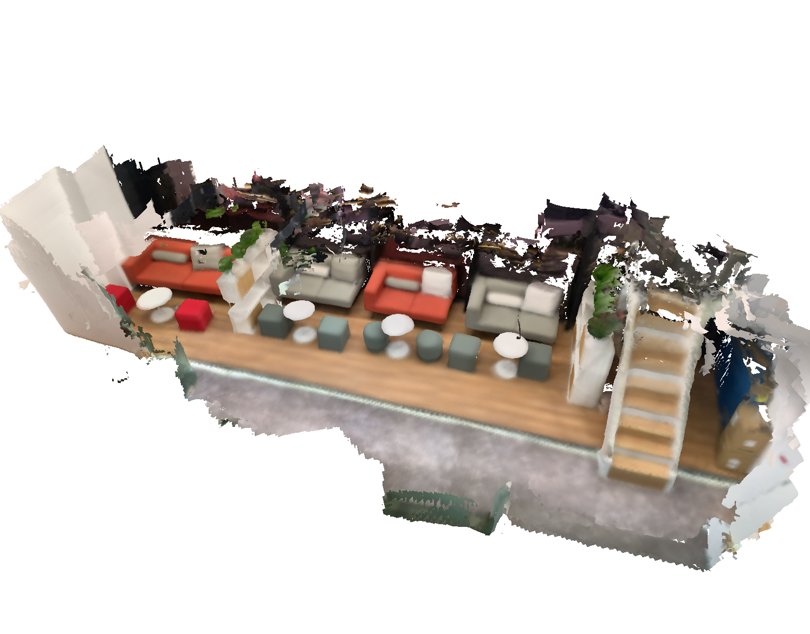

# Running with NeuralRecon's demo data and data from ios-logger.

Download the demo scene out of ios-logger from here: https://github.com/zju3dv/NeuralRecon/blob/master/DEMO.md

Follow the instructions in the NeuralRecon repo for how to use ios-logger to make your own captures.

Unzip the folder into your arkit dataset path so that it looks somthing like this:

```
    dataset_path
        scans 
            neucon_demodata_b5f1
                ...
            ....
```

Run the extraction script that uses modified versions of the functions provided by the NeuralRecon authors:

```bash
python ./data_scripts/ios_logger_preprocessing.py --data_config configs/data/neucon_arkit_default.yaml 
```

Make sure you set your correct `dataset_path` folder.

Run tuple file generation (we've already computed one for you in data_splits):

```bash
python ./data_scripts/generate_test_tuples.py  --num_workers 16 --data_config configs/data/neucon_arkit_default.yaml
```

Then run the model using this config file, see the full readme for more. 

There is unfortunately a break in the pose in the NR demo scene, so you'll to trim the first 350 frames using `--skip_to_frame 350` when running dense frames and `--skip_to_frame 83` when running default.

Run:

```bash
CUDA_VISIBLE_DEVICES=0 python test.py --name HERO_MODEL \
            --output_base_path OUTPUT_PATH \
            --config_file configs/models/hero_model.yaml \
            --load_weights_from_checkpoint weights/hero_model.ckpt \
            --data_config configs/data/neucon_arkit_default.yaml \
            --num_workers 8 \
            --batch_size 2 \
            --fast_cost_volume \
            --run_fusion \
            --depth_fuser open3d \
            --fuse_color \
            --skip_to_frame 83;
```

```bash
CUDA_VISIBLE_DEVICES=0 python test.py --name HERO_MODEL \
            --output_base_path OUTPUT_PATH \
            --config_file configs/models/hero_model.yaml \
            --load_weights_from_checkpoint weights/hero_model.ckpt \
            --data_config configs/data/neucon_arkit_dense.yaml \
            --num_workers 8 \
            --batch_size 2 \
            --fast_cost_volume \
            --run_fusion \
            --depth_fuser open3d \
            --fuse_color \
            --skip_to_frame 350;
```

Should get an output that looks like this for default frames: 

